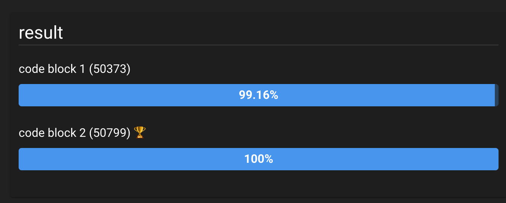

# `typeof` 와 `instanceof`

> [ECMAScript typeof](/til/ecmascript/13-5-3.md)

자바스크립트에서는 타입에 대한 정보를 얻어서 처리할 때 `typeof` 또는 `instanceof` 를 사용한다.

## `typeof`

- operand를 string 으로 return.

Type | Result
:---:|:---:
Undefined | "undefined"
Null | "object" (see below)
Boolean | "boolean"
Number | "number"
BigInt (new in ECMAScript 2020) | "bigint"
String | "string"
Symbol (new in ECMAScript 2015) | "symbol"
Function object (implements [[Call]] in ECMA-262 terms) | "function"
Any other object | "object"

:::tip
 [MDN typeof Real World Usage](https://developer.mozilla.org/en-US/docs/Web/JavaScript/Reference/Operators/typeof#real-world_usage)

- 존재하지 않는 값을 체크할 때 사용하거나 한다.
:::

### 예시

- [MDN basic example](https://developer.mozilla.org/en-US/docs/Web/JavaScript/Reference/Operators/typeof#basic_usage)
- `new` operator 를 사용하면 'object'를 return!

```js
// constructor function 으로 생성되면 'object' (단, Function constructor 예외)
let str = new String('String');
let num = new Number(100);

typeof str; // It will return 'object'
typeof num; // It will return 'object'

let func = new Function();

typeof func; // It will return 'function'
```

- regular expression

```js
typeof /s/ === 'function'; // Chrome 1-12 Non-conform to ECMAScript 5.1
typeof /s/ === 'object';   // Firefox 5+  Conform to ECMAScript 5.1
```

### 에러

- 기본적으로 에러는 발생하지 않는다.
- 단 같은 scope 내에서 논리적인 순서에 의한 reference error 는 발생한다.

```js
typeof undeclaredVariable === 'undefined';

typeof newLetVariable; // ReferenceError
typeof newConstVariable; // ReferenceError
typeof newClass; // ReferenceError

let newLetVariable;
const newConstVariable = 'hello';
class newClass{};
```

### 예외

#### `document.all`

```js
// true
typeof document.all === 'undefined';
```

- ECMAScript에서는 웹표준에서의 고의적 위반(willful violation)으로 분류된다.

#### IE

> [typeof IE Note MDN 문서](https://developer.mozilla.org/en-US/docs/Web/JavaScript/Reference/Operators/typeof#ie-specific_notes)

- 많은 host object 들이 `typeof` 연산자를 사용했을 경우 `'function'`이 아닌 `'object'` 가 return.

```js
// IE6, 7, 8
typeof alert === 'object' // true
```

- non-standard value 를 return 하기도 함.

```js
typeof window.external.AddSearchProvider === "unknown";
typeof window.external.IsSearchProviderInstalled === "unknown";
```

## `instanceof`

> [MDN docs instanceof](https://developer.mozilla.org/en-US/docs/Web/JavaScript/Reference/Operators/instanceof)

- 비교적 복잡한 구조(class 등)의 타입 정보를 얻을 땐, instanceof 를 사용하는 것이 좋다.


```js
// defining constructors
function C() {}
function D() {}

let o = new C()

// true, because: Object.getPrototypeOf(o) === C.prototype
o instanceof C

// false, because D.prototype is nowhere in o's prototype chain
o instanceof D

o instanceof Object           // true, because:
C.prototype instanceof Object // true

C.prototype = {}
let o2 = new C()

o2 instanceof C  // true

// false, because C.prototype is nowhere in
// o's prototype chain anymore
o instanceof C

D.prototype = new C()  // add C to [[Prototype]] linkage of D
let o3 = new D()
o3 instanceof D        // true
o3 instanceof C        // true since C.prototype is now in o3's prototype chain
```

## Performance

둘의 성능차이는 거의 없다고 봐도 무방하다.


:::danger
단, 일일히 literal 로 비교하지 않도록 주의하자. 선언이 아주 미약하지만 영향을 미친다.
:::




## summary

- 타입에 대한 정보를 얻고 싶을 때 자바스크립트에서 사용하는 것은 typeof, instanceof이다.
