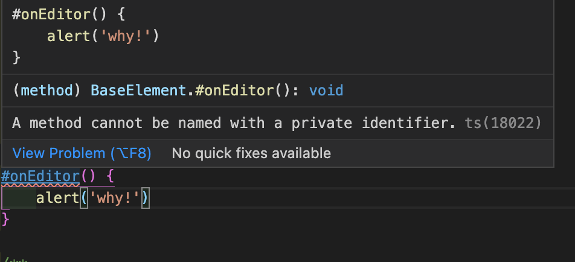

# Typescript 에서 private class fields 사용하기 -2-

> [이전 포스팅](2021-04-18-tsprivateclassfields.md)

- 나중에야 안 사실이지만, 비교적 최근에 와서야 static 과 methods 에 관해서
  제대로 transpilling 되는 typescript 버전이 나왔다.
- 물론 아직은 베타버전이며, typescript 4.3 정식버전이 나오기를 기대하고 있다.

## 프로세스

- [ES private class elements](https://github.com/microsoft/TypeScript/pull/42458)
  - [0325dev playground](https://www.typescriptlang.org/play?ts=4.3.0-dev.20210325#code/MYGwhgzhAECC0G8BQ1XQgFzBglsaAxAGY4CmIAJtALzQCMADCmptnoQLakYAWA9hQAUASmgAuaADc+OKggC+0APRLoAOz7RSAJ219tSZqla58Ac26E9ABT0AHEYmjbuAV21roDANzR5R9CxTdEsCAHc+Wz4HSTAQV1IJNVcOACMdUQQ-QzRAtnNQu3tHLJcMd08GbNyTdghC4tj4xPUU9O1M7IDa-AxSTBKA3OA+NQg+EFIAOhA+M0FYKeIySmFvIbRF5fIqWkZ13Nytrl4BEQPD1BGxienZ+a2bezWN1EfI+xp6JkvUV+hruNJjM5gslhEonYXr84OCPtEvowcr9AbcQQ8lkVotDflssXZET80P55EA)
- [Add support for ES.Next private methods and private accessor properties](https://github.com/microsoft/TypeScript/issues/39066)
- [Typescript 3.8.3 : Sharp notation for private method must be alloweded](https://github.com/microsoft/TypeScript/issues/37677)

## 특이 사항

- 현 시점 기준으로 beta version 을 사용했을 경우 오류없이 트랜스파일링 되나, vscode 에서 인식을 못한다.
- tsconfig, node 환경을 똑같이 줬는데도 그런다.
- 이유를 잘 모르겠지만, 금방 사라질 오류므로 어쩌다가 알게되는 게 아닌 이상 이리저리 찾지말자.
- 사라지기 전까지 거슬리니 `@ts-ignore`를 사용하자.

